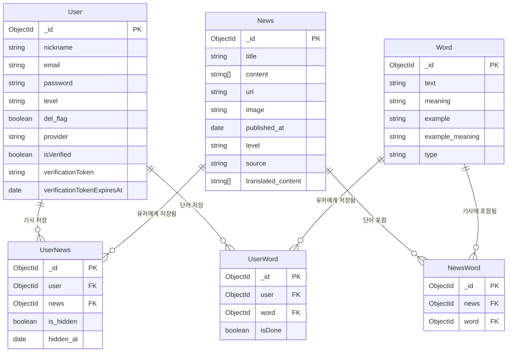

# 📰 NEWSBITE — Backend

> 하나의 뉴스, 나만의 난이도 — AI가 재구성한 경제 영어 학습 서비스

🔗 **프론트엔드 리포지토리**: https://github.com/Jaeework/newsbite-fe

<br />

## 🛠 기술 스택

| 분류 | 기술 |
|------|------|
| Runtime | Node.js |
| Framework | Express |
| Database | MongoDB · Mongoose |
| Auth | JWT · Google OAuth 2.0 · bcryptjs |
| AI / API | GPT-4o mini · The Guardian API |
| 이메일 | Nodemailer |
| Tooling | Git · GitHub |

<br />

## 📁 프로젝트 구조

```
src/
├── config/
│   └── db.js                # MongoDB 연결 설정
├── controllers/             # 요청/응답 처리 및 비즈니스 로직
│   ├── auth.controller.js
│   ├── news.controller.js
│   ├── user.controller.js
│   ├── userNews.controller.js
│   └── userWords.controller.js
├── middlewares/
│   ├── auth.middleware.js        # JWT 인증
│   └── option.auth.middleware.js # 선택적 인증
├── models/                  # MongoDB 스키마
│   ├── News.js
│   ├── NewsWord.js
│   ├── User.js
│   ├── UserNews.js
│   ├── UserWord.js
│   └── Word.js
├── routes/                  # API 라우터
│   ├── auth.api.js
│   ├── news.api.js
│   ├── user.api.js
│   └── index.js
├── services/                # 외부 API 호출
│   ├── email.service.js     # Nodemailer 이메일 발송
│   └── news.service.js      # Guardian API · OpenAI API
└── utils/
    ├── ApiError.js          # 커스텀 에러 클래스
    ├── errorHandler.js      # 전역 에러 핸들러
    └── scheduler.js         # 기사 수집 · 삭제 스케줄러
```

<br />

## 🏗 아키텍처


```
Request
  ↓
Router       → 라우팅
  ↓
Middleware   → JWT 인증 등 전처리
  ↓
Controller   → 요청/응답 처리 및 비즈니스 로직
  ↓
Service      → 외부 API 호출 (OpenAI, The Guardian)
  ↓
Model        → DB 스키마 정의
  ↓
MongoDB
```

<br />

## 📊 ERD
 

> 양방향 조회 지원, 관계별 추가 데이터(isDone, is_hidden 등) 저장,
> 도큐먼트 배열의 무한 증가 방지를 위해 다대다 관계를 중간 컬렉션으로 분리했습니다.
<br />

## 🚀 시작하기

```bash
# 패키지 설치
pnpm install

# 환경변수 설정
cp .env.example .env

# 개발 서버 실행
pnpm dev
```

<br />

## ⚙️ 환경변수 설정

`.env.example`을 복사해 `.env` 파일을 생성한 후 아래 값을 채워주세요.

| 변수명 | 설명 |
|--------|------|
| PORT | 서버 포트 번호 |
| CLIENT_URL | 프론트엔드 배포 주소 |
| MONGO_URI | MongoDB 연결 URI |
| GUARDIAN_API_KEY | The Guardian API 키 |
| OPENAI_API_KEY | OpenAI API 키 |
| JWT_SECRET | Access Token 서명 키 |
| JWT_REFRESH_SECRET | Refresh Token 서명 키 |
| GOOGLE_CLIENT_ID | Google OAuth 클라이언트 ID |
| EMAIL_USER | 인증 메일 발송 계정 |
| EMAIL_PASS | 인증 메일 발송 비밀번호 |
